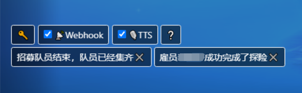

# FFXIV 关键字提醒

[🇺🇸English](README.md) | 🇨🇳简体中文

这是一个用于 FF14 ACT 插件 Ngld 悬浮窗插件的插件。添加关键字后，当关键字出现在聊天栏时，会有语音提醒和/或 Webhook 提醒。

## 截图
* 显示当前关键字列表；可切换 Webhook / TTS 的开关。
    * 

* 平时，只显示一个图标。点击以展开和隐藏界面。
    * 

## 使用方法
### 初次使用
1. 打开 ACT → 插件 → ngld 悬浮窗插件 → 新建。
2. 名称：随意，预设：自订，种类：数据统计。
3. 悬浮窗路径：`http://ffxiv.duetime.cn:8014/ffxivkeyword.html`。

### 增删关键字
1. 在游戏的聊天窗口内，输入 `/e 关键字 完成了探险` 来将 “完成了探险” 加入关键字列表。
2. 在游戏的聊天窗口内，再次输入 `/e 关键字 完成了探险` 来将 “完成了探险” 移出关键字列表。
3. 点击关键字的 ✖ 也可移除它。

### Webhook
* 在游戏的聊天窗口内，输入 `/e webhook <地址> <参数名>` 来加入关键字提示的 Webhook 通知。
* 点击“📡WEBHOOK”按钮来禁用/启用 Webhook 功能。

> Webhook 是什么？
>
> 当关键字被触发，插件将会以 POST 方式访问 `<地址>`，并且其中的数据为 `{<参数名>: <消息内容>}`。
>
> 例：你可以使用 [Slack](https://api.slack.com/apps) 设置 Webhook。新建一个 APP 激活（Activate） "Incoming Webhooks"，然后 "Add New Webhook to Workspace"，你将得到一个地址 `https://hooks.slack.com/services/ABC/DEF/GHIJKLMN`（默认参数名 `text`）。将这两者设置为插件的 Webhook，当关键字出现时，Slack 会将消息转发给你。在手机上安装 Slack，你就可以用手机接受关键字提醒了。

### TTS 语音播报
* 点击“🎙TTS”按钮来禁用/启用 TTS 功能。

## 第三方库
* jQuery: https://www.bootcdn.cn/jquery/
* BootStrap4: https://www.bootcdn.cn/twitter-bootstrap/
* Ngld Common JS: https://ngld.github.io/OverlayPlugin/assets/shared/common.min.js
