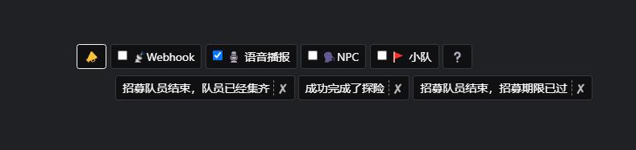
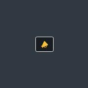

# FFXIV Keyword Notif

> 🇺🇸 English | [🇨🇳 简体中文](README-CN.md)

[🔗FFXIV Keyword Notif](https://ffxiv-plugins.github.io/FFXIV-Keyword-Notif/) This is a plugin for FFXIV ACT Ngld Overlay. Add keyword, and when the keyword show up in chat window, notify in voice and/or webhook.

## Screenshots
* Show keywords and toggle Webhook and TTS on/off.
    * 

* Normally, only an icon shows up. Click to hide/show dashboard.
    * 

## Usage
### Get Started
1. Open ACT → Plugin → ngld Overlay → new.
2. Name: Keyword, Preset: Custom, Catagory: Data.
3. Overlay Path: `https://ffxiv-plugins.github.io/FFXIV-Keyword-Notif/ffxivkeyword.html`

### Add/Remove Keywords
1. In game chat window, say `/e keyword foo` to add 'foo' as a keyword;
2. In game chat window, say `/e keyword foo` again to remove 'foo' from keywords;
3. You can also click on the keyword to remove it.

### Webhook
* In game chat window, enter `/e webhook <url> <key>` for webhook notification.
* Click on "📡WEBHOOK" Button to switch webhook notification on/off.

> How Webhook works:
>
> When the keyword shows, This plugin visit `<url>` by POST with data `{<key>: <message>}`. Like `url?key=<message>` but in POST.
>
> For example: You can setup your webhook in [Slack](https://api.slack.com/apps). Create a new APP, turn on the "Incoming Webhooks", activate, and then "Add New Webhook to Workspace", you will get an URL such as `https://hooks.slack.com/services/ABC/DEF/GHIJKLMN`, and `text` as the data key name. Set this as plugin webhook notification, when the keywords show up, the slack app you just created will send you a message. If you have Slack on your phone, then you can catch the keywords notification on your phone.

### TTS
* Click on "🎙TTS" Button to switch text-to-speech notification on/off.

### Voices for NPC
* Click on "🗣️NPC" Button to switch voices for NPC on/off.

## 3rd Party Libs
* [🔗jQuery](https://www.bootcdn.cn/jquery/) · [🔗BootStrap4](https://www.bootcdn.cn/twitter-bootstrap/) · [🔗Ngld Common JS](https://ngld.github.io/OverlayPlugin/assets/shared/common.min.js)
